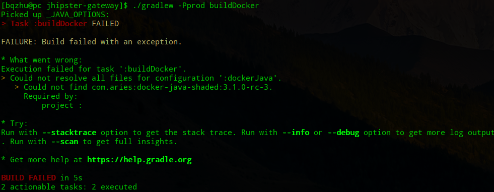

# Deploying with Docker Compose
##  Sub-generators for microservices
Used to create configuration files to containerize, deploy, and manage the microservices.
- `Docker` : also helps to orchestrate the deploytment.
- `Kubernetes`: also provides private cloud deployment.
- `OpenShift` : also provides private cloud deployment.
- `Rancher`: provides : also provides complete container management.

## A short introduction to Docker Compose
Shipping code to the servcer is difficult.
```bash
# Start
docker-compose -f <docker-file> up
# Stop
docker-compose -f <docker-file> down
# List the running services and their status
docker ps
# See logs
docker log <dontainer-id>
```
## Kickstarting Kubernetes
Docker-compose is really good for creating and starting your application. However, when you want to update an existing container, there will be` a definite downtime`, since it will recreate the entire container.

---

Kubernetes is an open-source system for automating deployment, scaling, and management of containerized applications. It provides `zero downtime` whne you roll out a newer application or update an existing applications.
- `Pod` : a single deployable component in kubernetes,
- `Ingress` : Ingress forms a layer between the services and the internet so that all the inbound connections are controlled or configured with ingreee controller before sending them to Kubernetes services on the cluster.
-  `Egress` : Egress controller controls or configures services going out of the kubernetes cluster.

### Kuberctl CLI
Use the `kubectl CLI ` tool for management. Despite the fact that we use Docker images inside, the `Docker CLI`can't be used.
- `Minikube(minified Kubernetes)` : used for developing and testing applocations locally.

## Introducing OpenShift
OpenShift is a multi-cloud, open source container application platform.
- `For developers` : provides a self-service platform in which they can provision, build, and deploy applications and their components.With automated workflows for converting your source to the image, it helps developers go from source to ready-to-run, dockerized images
- `For operations` : provides a secure, enterprise-grade Kubernetes for policy-based controls
and automation for application management, such as `cluster services` , `scheduling` , and `orchestration` with load balancing and `auto-scaling` capabilities.
- JHipster also provides OpenShift deployment files as a seperate sub-generator
```bash
jhipster openshift
```
## Explaining Rancher
Rancher is a open source container management platform.
```bash
jhipster rancher
```

## Generated Docker Compose files
See the comment  in files from `src/main/docker` .
## Working through the generated files.

## Building and deploying everything to Docker locally.
- Package application as Docker image.
Modify the file `docker.gradle` to fix the flowing bug

```bash
# first Dockerize the application by taking a production build of our application with following command
./gradlew -Pprod clean bootWar buildDocker
# start the app via the docker-compose command
docker-composr -f src/main/docker/app.yml up -d
```

## Generating  docker -compose files for all microservices
There many docker-compose files scattered across so many microservices and maintaining them is hard.
JHipster provides a docker-compose sub generator to helps you to organize all existing Dockerfiles.
```bash
jhipster docker-compose
```
## JHipster console demo
JHipster provides a console app based on the ELK stack, which can be used for logs and metrics  monitoring of the app.
