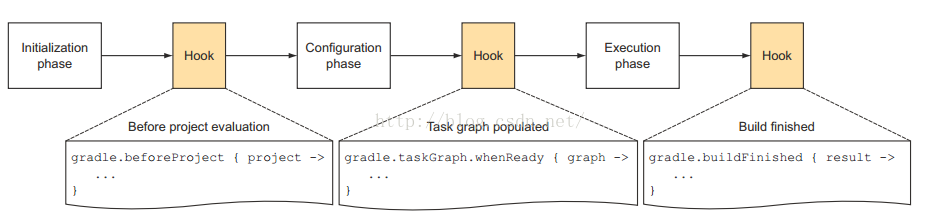

# Gradle
>  [读懂gradle语法](https://help.gradle.org)
>
> [Gradle user guide](http://blog.didispace.com/books/GradleUserGuide/)
>
> [阿拉神农](https://www.jianshu.com/p/6dc2074480b8)
>
> [Gradle Build Language Reference](https://docs.gradle.org/current/dsl/)
>
>[Gradle API](https://docs.gradle.org/current/javadoc/org/gradle/api/Project.html)
> [Gradle构建最佳实践](http://www.figotan.org/2016/04/01/gradle-on-android-best-practise/).
>
> [W3CShool Gradle教程](https://www.w3cschool.cn/gradle/ms7n1hu2.html)

> gradle 优点 ：
1. 按约定声明构建和建设；
2. 强大的支持多工程的构建；
3. 强大的依赖管理（基于Apache Ivy），提供最大的便利去构建工程；
4. 全力支持已有的 Maven 或者Ivy仓库基础建设；
5. 支持传递性依赖管理，在不需要远程仓库和pom.xml和ivy配置文件的前提下；
6. 基于groovy脚本构建，其build脚本使用groovy语言编写；
7. 具有广泛的领域模型支持构建；
8. 深度 API；
9. 易迁移；
10. 自由和开放源码，Gradle是一个开源项目，基于 ASL 许可。

## Groovy
### Groovy中bean的概念
- Groovy为每一个字段都会自动生成getter和setter，并且我们可以通过像访问字段本身一样调用getter和setter
### 闭包的Delegate机制 :thumbsup:
> [Groovy闭包](https://blog.csdn.net/u014099894/article/details/51118703)

- `闭包` ： A closure in Groovy is an open, anonymous, block of code that can take arguments, return a value and be assigned to a variable.（Groovy中的闭包是一段 开放的、匿名的代码)。
  -  `this`： 包所在的最近的类 .class
  - `owner` : 定义闭包的宿主，不仅仅是类，还可能是一个闭包
  -  `delegate` : 代理
- `闭包的Delegation` : The ability to change the delegate or change the delegation strategy of closures make it possible to design beautiful domain specific languages (DSLs) in Groovy.(Groovy中的闭包具有能够改变代理或代理策略的这种能力，使得我们能够使用它设计出很优美的DSL语言。）

### Gradle Introduction
 > 看待问题的时候，所站的角度非常重要。当你把Gradle当工具看的时候，我们只想着如何用好它。会写、写好配置脚本就OK。当你把它当做编程框架看的时候，你可能需要学习很多更深入的内容。另外，今天我们把它当工具看，明天因为需求发生变化，我们可能又得把它当编程框架看

- Gradle是一个框架，作为框架，它负责定义流程和规则。而具体的编译工作则是通过插件的方式来完成的
- `build.gradle`: 配置其他子Project的。比如为子Project添加一些属性。这个build.gradle有没有都无所属。
- `settings.gradle`: 这个文件很重要，名字必须是settings.gradle。它里边用来告诉Gradle，这个multiprojects包含多少个子Project。
- Gradle 工作流程:

    
    -  *`Initialization phase`* : 比如执行settings.gradle
    -  *`Configuration Phase`* : 解析每个project中的build.gradle
      - Configuration阶段完了后，整个build的project以及内部的Task关系就确定了。一个Project包含很多Task，每个Task之间有依赖关系。Configuration会建立一个有向图来描述Task之间的依赖关系。
    -  *`Execution Phase`* : 执行任务

### Gradle 详解
> Gradle基于Groovy，Groovy又基于Java

#### 三种脚本<-->三种对象(*`delegate object`*)
  - `Build script`<-->`project`:当我们执行gradle xxx或者什么的时候，gradle会从默认的配置脚本中构造出一个Gradle对象。在整个执行过程中，只有这么一个对象。Gradle对象的数据类型就是Gradle。我们一般很少去定制这个默认的配置脚本。
  - `Init script`<-->`Gradle`:每一个build.gradle会转换成一个Project对象
  -  `Settings script`<-->`Settings`:显然，每一个settings.gradle都会转换成一个Settings对象。

#### Lifecycle
- Gradle 对象
- Project 对象 ：
每一个build.gradle文件都会转换成一个Project对象
  - 加载组件： `apply`
    - 当一个Project apply一个gradle文件的时候，这个gradle文件会转换成一个Script对象;
    - Script中有一个delegate对象，这个delegate默认是加载（即调用apply）它的Project对象。但是，在apply函数中，有一个from参数，还有一个to参数。通过to参数，你可以把delegate对象指定为别的对象；
    - delegate对象是什么意思？当你在Script中操作一些不是Script自己定义的变量，或者函数时候，gradle会到Script的delegate对象去找，看看有没有定义这些变量或函数；
  - 设置属性: 如果是单个脚本，则不需要考虑属性的跨脚本传播，但是Gradle往往包含不止一个build.gradle文件， 如何在多个脚本中设置属性呢？
  - *`Task`* ：Task是Gradle中的一种数据类型，它代表了一些要执行或者要干的工作。不同的插件可以添加不同的Task。每一个Task都需要和一个Project关联。
    - 一个Task包含若干Action。所以，Task有doFirst和doLast两个函数，用于添加需要最先执行的Action和需要和需要最后执行的Action。Action就是一个闭包;
    - Task创建的时候可以指定Type，通过type:名字表达。这是什么意思呢？其实就是告诉Gradle，这个新建的Task对象会从哪个基类Task派生。比如，Gradle本身提供了一些通用的Task，最常见的有Copy 任务。Copy是Gradle中的一个类。当我们：task myTask(type:Copy)的时候，创建的Task就是一个Copy Task。
    - 当我们使用 taskmyTask{ xxx}的时候。花括号是一个closure。这会导致gradle在创建这个Task之后，返回给用户之前，会先执行closure的内容。
    - 当我们使用taskmyTask << {xxx}的时候，我们创建了一个Task对象，同时把closure做为一个action加到这个Task的action队列中，并且告诉它“最后才执行这个closure”（注意，<<符号是doLast的代表）。
