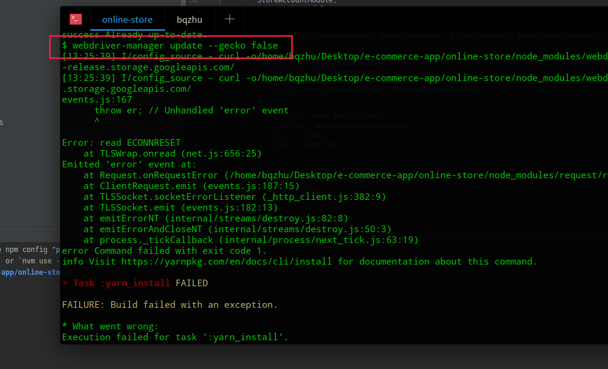
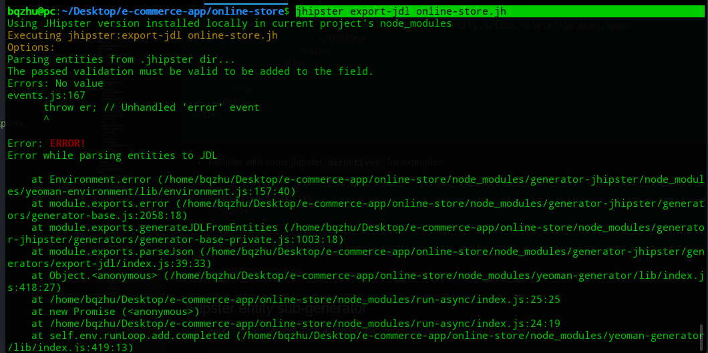
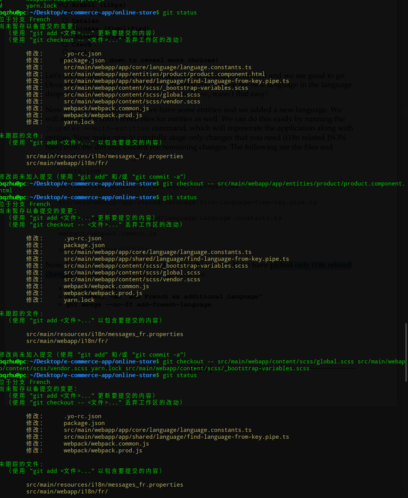
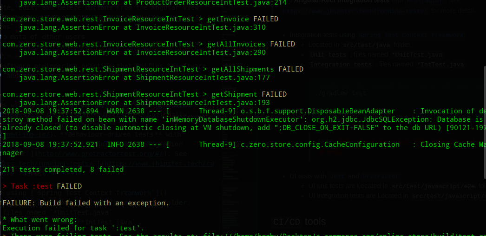
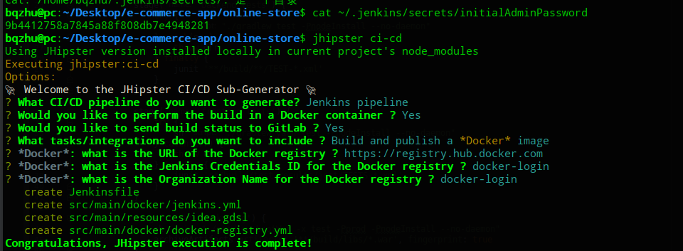

# Jhipster
## Installation
- Tips :
 ```bash
 # to see all available commands
jhipster --help
# To see help infomation for main app generation process.
jhipster app --help
```

### Yarn
- 添加源
```bash
node -v
v10.4.1
npm -v
6.1.0
curl -sS https://dl.yarnpkg.com/debian/pubkey.gpg | sudo apt-key add -
echo "deb https://dl.yarnpkg.com/debian/ stable main" | sudo tee /etc/apt/sources.list.d/yarn.list`
sudo apt-get update && sudo apt-get install yarn --fix-missing  |  
bqzhu@pc:~$ which -a node
/home/bqzhu/.nvm/versions/node/v10.4.1/bin/node
/opt/node/bin/node
/usr/local/bin/node
/usr/bin/node
bqzhu@pc:~$ sudo apt remove nodejs
bqzhu@pc:~$ which -a node
/home/bqzhu/.nvm/versions/node/v10.4.1/bin/node
/opt/node/bin/node
/usr/local/bin/node
```
> curl s : 表示下载的意思<br>
apt-key add keyname, 把下载的key添加到本地trusted数据库中。<br>
'-' : 表示标准输入;<br>
tee file :输出到标准输出的同时，保存到文件file中

### Docker
> [deepin docker install](https://segmentfault.com/a/1190000013637975)

### pip
> [pip install](https://www.jianshu.com/p/fd3415eb8618)

```console
wget https://bootstrap.pypa.io/get-pip.py  --no-check-certificate
sudo python get-pip.py
```

### Starting the application
<font color="red">可能是网络原因</font>


## Running generated tests
> Good software development is never complete without good testing.

## Jhipster Domain Language(JDL)
- Entity modeling on JDL studio
  - [`online-store.jh`](online-store.jh)
  ```bash
  jhipster import-jdl online-store.jh
  ```
## Customization and Further Development
### Live reload
- [`Spring DevTools`](https:/​/​docs.​spring.​io/​spring-​boot/​docs/​current/​reference/
html/​using-​boot-​devtools.​html)
```bash
# start the server in dev mode.
./gradlew
# when making any changes on the server side
./gradlew compileJava
```
- [`Webpack dev`](https:/​/​github.​com/​webpack/​webpack-​dev-​server) and [`BrowserSync`](https:/​/​browsersync.​io/​)
```bash
# start the client development server
yarn start
```

### Customizing the frontend
- Familiar with some jhipster `directives`, for example :
```bash
jhiHasAnyAuthority
*ngFor
...
```
- Angular currency pipe

### JHipster entity sub-generator
- export current model back to the jdl
```bash
jhipster export-jdl online-store.jh
```


- `Liquibase` : when emcountering on a checksum error.

```bash
 ./gradlew compileJava.
 ./gradlew clean to clear the DB and start the application again

```
### Changing the theme of the application
- [`bootswatch`](https:/​/​bootswatch.​com/​) : Install all the bootstrap themes.
```bash
yarn add bootswatch
```
- @import the theme you want :`src/main/webapp/content/scss/`.

### Support a new i18n Language

- Switch to a new branch
```bash
git checkout -b French
#install new Languages
jhipster lanuages
#get i18n French files for entities
jhipster --with-entities
#撤销一些本地的不必要的更改
git checkout -- xxx ...
#picked only i18n related changes
git add -A
git commit -m "French"
#Switch back to master
git checkout master
git merge --no-ff French
...
```
# 
### Authorization with [`Spring Security`](https:/​/​projects.​spring.​io/​spring-​security/​.)
- Limiting access to entities
  - API level : `.../SecurityConfiguration.java`
  - Hide the entites in the menu for normal user using `*jhiHasAnyAutoriuty="'ROLE_ADMIN'"` directive : `.../navbar.component.html`
- Limiting access to create/edit/delete entitites
    - API level using the Spring Security `PreAuthorize` annotation.
    ```java
    @PreAuthorize("hasAuthorize('ROLE_ADMIN')")
    public ResponseEntity<Void> deleteOrderItem(@PathVariable Long id) {
...
}
    ```
    - Hide the create, edit, and delete buttons from the Angular view using the `*jhiHasAnyAutoriuty="'ROLE_ADMIN'"` directive.
    - `PostAuthorizes`
- Limiting access to data of other users

## Testing and Continuous Integ
> **DevOps** is a software engineering practice that unifies **software development (Dev)** and **software operation (Ops)**

### Fixing and running tests
> **Jhipster** comes with an extensive of tests. and each generated application has **integration tests** and **UI tests**. Optionally, JHipster also can generate **Performance tests** with [`Gatling`](https://gatling.io/)、**Behaviour-driven tests** with [`Cucumber`](https://cucumber.io/) and **Angular/Rect integration tests** with [`Protractor`](http://www.protractortest.org/#/). See [`https://www.jhipster.tech/running-tests/`](https://www.jhipster.tech/running-tests/) for more  detail.

- Integration tests using [`Spring Test Context freamwork`]()
	- Located in <font color="HotPink">`src/test/java`</font> folder.
	- `Unit tests` : files named `*UnitTest.java`
	- `Integration tests` : files named `*IntTest.java`
  ```bash
  # generate both integration tests and unit tests for the server side
  ./gradlew test
  ```

    > Note : <font color="red">Select the entire src/test folder, right-click, and select Run all tests</font>.

    
- UI tests with [`Jest`](https://jestjs.io/) and [`Protractor`](http://www.protractortest.org/#/)
  - UI unit tests are Located in <font color="HotPink">`src/test/javascript/e2e`</font> folder.
  - UI integration tests are Located in <font color="HotPink">`src/test/javascript/spec`</font> folder.
  ```bash
  # make sure client-side Karma unit tests are working
  yarn test
  # make sure protractor e2e tests are working
  # clear the datbase *clean*
  # run the *webpackBuildDev* to rebuld the client side.
  ./gradlew clean webpackBuildDev bootRun
  # If you prefer not to run scripts vis Yarn or npm
  # instead of `yarn e2e`
 ./gradlew  yarn_e2e
  # instead of `yarn test`
  ./gradlew yarn_test
  ```

  ```json
  # ~/.nvm/versions/node/v10.4.1/lib/node_modules/protractor/node_modules/webdriver-manager/config.json
  http://npm.taobao.org/mirrorss/selenium
  http://npm.taobao.org/mirrors/chromedriver
  {
  "webdriverVersions": {
    "selenium": "2.53.1",
    "chromedriver": "2.27",
    "geckodriver": "v0.13.0",
    "iedriver": "2.53.1",
    "androidsdk": "24.4.1",
    "appium": "1.6.5"
  },
  "cdnUrls": {
    "selenium": "https://selenium-release.storage.googleapis.com/",
    "chromedriver": "https://chromedriver.storage.googleapis.com/",
    "geckodriver": "https://github.com/mozilla/geckodriver/releases/download/",
    "iedriver": "https://selenium-release.storage.googleapis.com/",
    "androidsdk": "http://dl.google.com/android/"
  }
}
# 无效
  ```

### `CI/CD` tools
> [`Jenkins`](https:/​/​jenkins.​io/),[`Travis CI`](https:/​/​travis-​ci.​org/),[`GitLab CI`](https:/​/​about.​gitlab.​com/​features/​gitlab-​ci-​cd/),[`Circle CI`](https:/​/​circleci.​com/​)

  - Setting up the **CI** with `Jenkins.war`
  ```bash
  # download the latest binary , also you can use Doker
  http:/​/​mirrors.​jenkins.​io/​war-​stable/latest/​jenkins.​war
  # start a Jenkins server
  java -jar jenkins.war --httpPort=8989
  # navigate to url
  localhost:8989
  # click on `Install suggested plugins`
  # create an admin user on next page and complete.
  ```
  - Creating a `Jenkins Pipeline` Using `Jhipster ci-cd sub-generator`
  
  - Setting up the `Jenkinsfile` in a `Jenkins server`
  ```bash
  # make sure you have uploaded your application to a GIT server, such as GitLab, GitHub,BitBucket.
  # go to the Jenkins server,and create mew jobs.
  http://localhost:8989/
  # enter a name , select pipeline.
  # Build triggers.
  ```
  -
