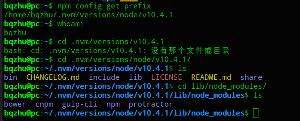

# NPM
> [getting started](https://docs.npmjs.com/getting-started/fixing-npm-permissions)
>
> [阮一峰NPM](http://javascript.ruanyifeng.com/nodejs/npm.html#)+[github](https://github.com/wangdoc)
>
> [npm 与 package.json 快速入门教程](https://blog.csdn.net/u011240877/article/details/76582670)

## Blocked Network
- 使用一个proxy来代理访问，但是这个方法速度可能比较慢；
- 可以通过修改npm的配置文件让npm到另外的pacakge mirror站点去找package，通过如下命令
```bash
npm config set registry https://registry.npm.taobao.org
$ npm config set registry http://r.cnpmjs.org
# 或者
$ npm config set registry http://registry.npmjs.eu
```

## Install npm packages(node-modules) globally
> [Install npm packages(node-modules) globally without sudo on macOS and Linux](https://github.com/sindresorhus/guides/blob/master/npm-global-without-sudo.md)

- 修改prefix，指定npm的全局package安装目录为自己的Home目录下面的子目录
```bash
$ npm config set prefix /home/bqzhu/.nvm/versions/node/v10.4.1
```

- npm全局安装的module安装在`{prefix}/lib/node_modules/`下，安装时保证对该目录有权限
```bash
# 当一个系统中有多个用户使用时，你把这些公共目录都搞成你自己的ownership，可能会存在问题
chown -R <prefix> your_usrname
```
```bash
# install npm globally
npm install -g npm@latest
npm install npm -g
npm cache clear && rm -rf node_modules && npm install
# 将列出所有已经配置好的npm选项
npm config ls
```
## Globally vs Locally
> 通常，如果使用-g参数则安装的nodejs module保存在`{prefix}/lib/node_modules` 目录中，对应的可执行文件在`{prefix}/bin`中, `{prefix}/share/man`中则保存帮助文件信息

 > 如果不使用-g参数，则直接安装在`./node_modules`目录下,而executable则保存在`./node_modules/.bin/`文件夹下

- 如果你安装的node module希望通过 require('modulename')来在你的程序中应用，那么就应该安装在local;
- 如果你希望安装一个可以在全局使用的命令行工具，这时就要用-g参数，因为安装的binary文件将在PATH环境变量中可以找到。
- 很多时候，你可能两者都会需要，比如webpack, gulp既有cli,又有lib代码需要在dev环境中使用,这时local和-g都安装一下
## 如何安装一个特定module的特定版本？
For example , install bootstrap :
```bash
npm info bootstrap versions
npm install --save bootstrap@4.1.3
```
## 常用命令
> [常用命令](http://www.nshen.net/article/2016-02-13/npm-js/)

- packages.json : 指明包依赖列表
  - "dependencies": these packages are required by your application in production
  - "devDependencies": these packages are only needed for development and testing
  - 安装package时自动加入依赖列表
  ```bash
  #  加入到dependencies
  npm install <package_name> --save
  #  加入到devDependencies
  npm install <package_name> --save-dev
  #  查看是否有新版本 ，分为 current wanted latest
  npm outdated
  ```
