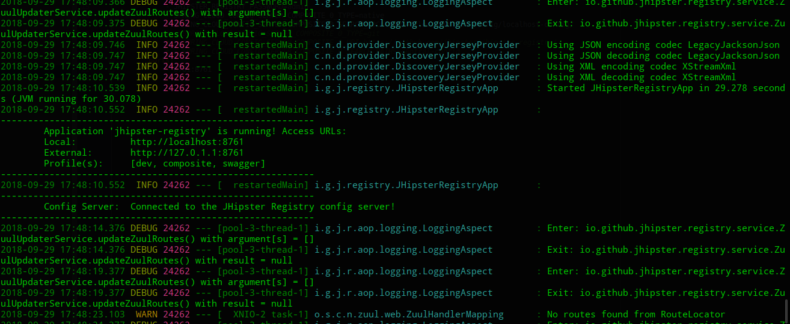

#  Working with microservices

## Setting up JHipster Registry
- Recap the role of JHipster Registry :
  - `Eureka Server` : helps in service discovery and load balancing the incoming requests.
  - `Spring Cloud Config Server` : acts as a single place , where we will manage the external properties of applications across environments. and also provides dashboard for users to manage and monitor the application.
- `Consul` : if you prefer consistency over the availability of services. ,and if you developing the microservices applications where different services are written in diferent lanuages.
- Three ways to setup and run Jhipster Registry :
  - `WAR file (pre-packaged)`
  - `Git clone repos`
  - `Docker container`
- Using a pre-packaged WAR file
  - [`Download Jhi-registry WAR file`](https://github.com/jhipster/jhipster-registry/releases)
  - Run :
  ```bash
  。。。。
  ```
- Using git repos :
  - meet frontend error : maybe related to `node-sass` and `yarn`
  
  
  - [Similar Bug](https://blog.csdn.net/ztz87/article/details/81734916)
## Run the microservice setup
